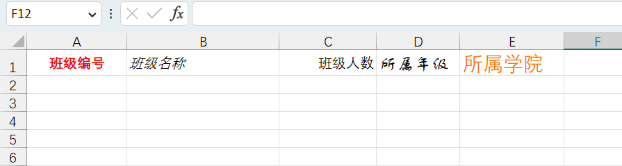
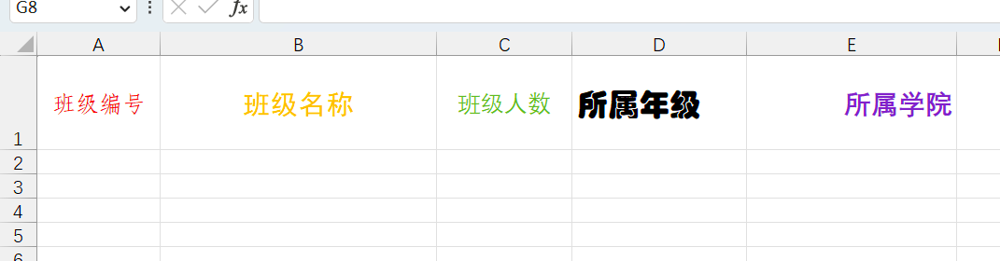
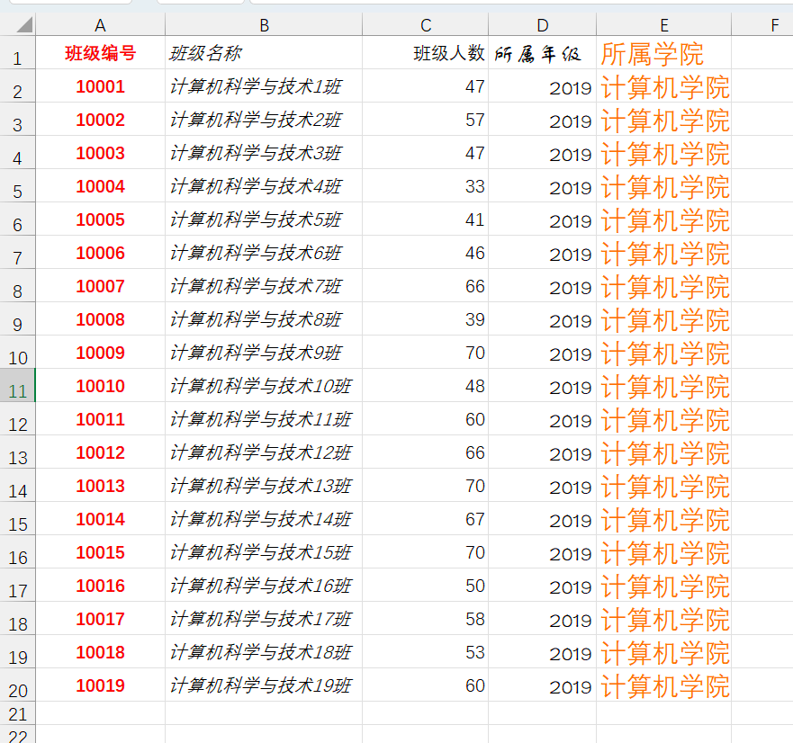
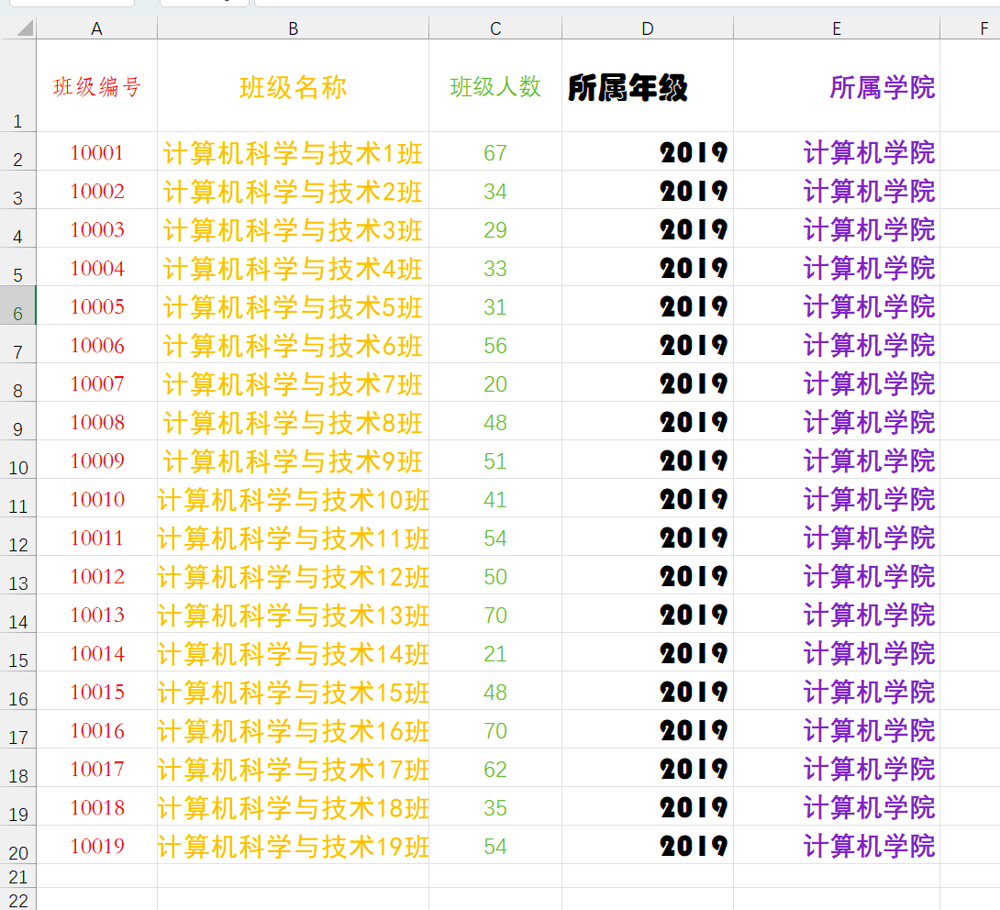

### 基于模板导出数据

首先准备一个excel模板，这个模板把复杂的样式和固定的内容先准备好并且放入到项目中，然后读取到模板后向里面放入数据


准备模板1




准备模板2




模板1：

```java
package mao;

import org.apache.poi.ss.usermodel.*;
import org.apache.poi.xssf.usermodel.XSSFWorkbook;

import java.io.FileInputStream;
import java.io.FileOutputStream;
import java.io.IOException;

/**
 * Project name(项目名称)：java报表_基于模板导出数据
 * Package(包名): mao
 * Class(类名): Test1
 * Author(作者）: mao
 * Author QQ：1296193245
 * GitHub：https://github.com/maomao124/
 * Date(创建日期)： 2023/6/4
 * Time(创建时间)： 14:04
 * Version(版本): 1.0
 * Description(描述)： 基于模板导出数据
 */

public class Test1
{
    /**
     * 得到int随机
     *
     * @param min 最小值
     * @param max 最大值
     * @return int
     */
    public static int getIntRandom(int min, int max)
    {
        if (min > max)
        {
            min = max;
        }
        return min + (int) (Math.random() * (max - min + 1));
    }

    public static void main(String[] args) throws IOException
    {
        Workbook workbook = null;
        try (FileInputStream fileInputStream = new FileInputStream("./class.xlsx"))
        {
            //创建工作簿
            workbook = new XSSFWorkbook(fileInputStream);
            //得到格式信息
            CellStyle cellStyle1 = workbook.getSheetAt(0).getRow(0).getCell(0).getCellStyle();
            CellStyle cellStyle2 = workbook.getSheetAt(0).getRow(0).getCell(1).getCellStyle();
            CellStyle cellStyle3 = workbook.getSheetAt(0).getRow(0).getCell(2).getCellStyle();
            CellStyle cellStyle4 = workbook.getSheetAt(0).getRow(0).getCell(3).getCellStyle();
            CellStyle cellStyle5 = workbook.getSheetAt(0).getRow(0).getCell(4).getCellStyle();

            Sheet sheet = workbook.getSheetAt(0);
            Row row = null;
            Cell cell = null;


            for (int i = 1; i < 20; i++)
            {
                //创建行，第i行
                row = sheet.createRow(i);
                //创建单元格
                cell = row.createCell(0);
                cell.setCellValue(10000 + i);
                cell.setCellStyle(cellStyle1);

                cell = row.createCell(1);
                cell.setCellValue("计算机科学与技术" + i + "班");
                cell.setCellStyle(cellStyle2);

                cell = row.createCell(2);
                cell.setCellValue(getIntRandom(20, 70));
                cell.setCellStyle(cellStyle3);

                cell = row.createCell(3);
                cell.setCellValue(2019);
                cell.setCellStyle(cellStyle4);

                cell = row.createCell(4);
                cell.setCellValue("计算机学院");
                cell.setCellStyle(cellStyle5);
            }
        }
        catch (Exception e)
        {
            e.printStackTrace();
        }


        //关闭
        try (FileOutputStream fileOutputStream = new FileOutputStream("class3.xlsx"))
        {
            //写入
            workbook.write(fileOutputStream);
            //关闭
            workbook.close();
        }
        catch (Exception e)
        {
            e.printStackTrace();
        }
    }
}
```





模板2




